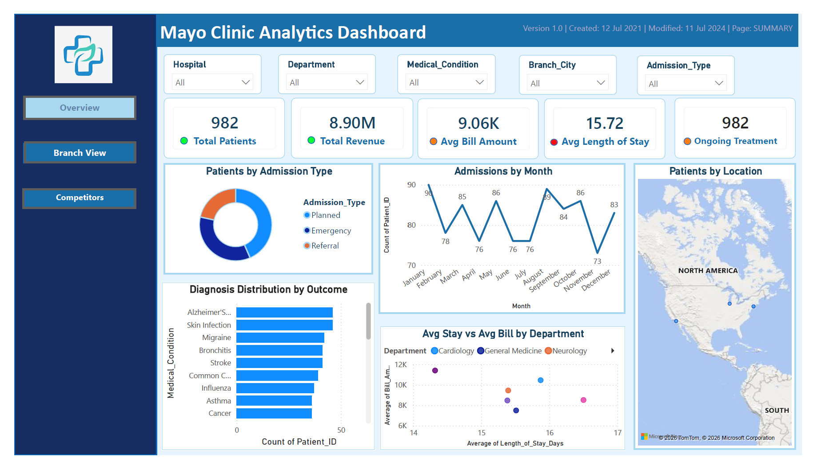

  

# --- Healthcare Analytics Dashboard using Power BI ---

## -- Project Overview --

This project presents an interactive healthcare analytics dashboard developed using **Microsoft Power BI**. The dashboard transforms raw hospital data into meaningful insights through data cleaning, visualization, and business intelligence techniques.

The objective of this project is to support data-driven decision-making by analysing hospital performance, patient demographics, financial metrics, and clinical operations using interactive dashboards.

## -- Objectives --

* Analyse hospital admission and discharge trends.
* Monitor financial performance through revenue-related KPIs.
* Explore patient demographics and admission patterns.
* Evaluate departmental performance.
* Present healthcare insights through interactive visualizations.

## -- Technologies Used --

* Microsoft Power BI
* Power Query
* Microsoft Excel
* Data Visualization
* Business Intelligence

## -- Repository Contents --

| File                                    | Description                |
| --------------------------------------- | -------------------------- |
| `Healthcare_Analytics.pbix`             | Power BI dashboard project |
| `Healthcare_Dataset.xlsx`               | Dataset used for analysis  |
| `Healthcare_Analytics_Report.docx`      | Project report             |
| `Healthcare_Analytics_Presentation.pdf` | Project presentation       |
| `Screenshots.pdf`                       | Dashboard screenshots      |

## -- Dashboard Features --

The dashboard includes multiple interactive pages that provide insights into:

* Hospital Overview
* Patient Demographics
* Financial Performance
* Clinical Performance
* Department Analysis
* Admission Trends

Interactive slicers allow users to filter information dynamically for deeper analysis.

## -- Data Preparation --

The dataset was prepared using **Power Query** by:

* Handling missing values
* Removing duplicate records
* Correcting data types
* Creating calculated columns where required
* Transforming data into an analysis-ready format

## -- Key KPIs --

The dashboard presents several key performance indicators, including:

* Total Revenue
* Average Bill Amount
* Average Length of Stay
* Total Admissions
* Patient Distribution
* Department Performance

## -- Key Insights --

Some insights generated from the dashboard include:

* Patient admission patterns across different admission types.
* Revenue distribution among hospital departments.
* Comparison of average hospital stay across departments.
* Demographic trends based on age and gender.
* Department-level operational performance.

## -- How to Use --

1. Download the repository.
2. Open `Healthcare_Analytics.pbix` using Microsoft Power BI Desktop.
3. Refresh the dataset if required.
4. Explore the interactive dashboard using filters and slicers.

## -- Skills Demonstrated --

* Data Cleaning
* Data Transformation
* Dashboard Design
* KPI Development
* Business Intelligence
* Data Visualization
* Analytical Thinking
* Power Query
* Power BI

## -- Project Documentation --

The repository includes:

* Full Power BI dashboard
* Dataset
* Project report
* Presentation slides
* Dashboard screenshots

---

## -- Author --

**Niduli Gokaralla**

GitHub: https://github.com/Niduli-Gokaralla

LinkedIn: 
linkedin.com/in/niduli-gokaralla

